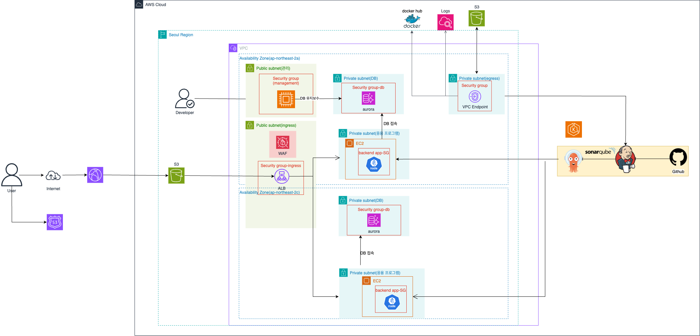

# PeopleHub - 미니 ems 시스템

# AWS 아키텍처

### 💡 **아키텍처 분석**
---

#### 🌐 **구성 요소 요약**
1. **프론트엔드**
   - **S3**: 정적 웹 사이트 호스팅
   - **CloudFront**: S3와 직접 연결 (HTTPS 처리)

2. **백엔드**
   - **ALB (Application Load Balancer)**: 퍼블릭 서브넷에 위치하여 WAF와 연결됨
   - **EC2 인스턴스**: 백엔드 애플리케이션(Node.js) 실행
   - **Aurora DB**: 프라이빗 서브넷에 위치하여 DB 접근

3. **CI/CD 구성**
   - **Jenkins + SonarQube**: CI/CD 파이프라인 구축
   - **GitHub**: 소스 코드 관리
   - **Docker Hub**: Docker 이미지를 저장하여 배포

4. **네트워크**
   - **VPC Endpoint**: S3 접근 시 프라이빗 네트워크 사용
   - **Private Subnet (Egress)**: 내부 애플리케이션이 S3에 접근할 때 사용
   - **Public Subnet (Ingress)**: ALB가 위치하여 외부 요청 수신

---

### 📝 **아키텍처 흐름**
1. **프론트엔드 접근**
   - 사용자가 인터넷을 통해 **CloudFront** 또는 직접 **S3**에 접근하여 정적 웹 페이지를 로드

2. **백엔드 API 호출**
   - 프론트엔드에서 **ALB**를 통해 백엔드(Node.js)로 API 요청
   - ALB는 **퍼블릭 서브넷**에 위치하여 외부 트래픽을 수신

3. **백엔드와 데이터베이스 연결**
   - 백엔드 EC2 인스턴스는 **프라이빗 서브넷**에 위치하여 외부와 직접 연결되지 않음
   - DB는 **프라이빗 서브넷**에 위치하여 외부 접근 차단

4. **CI/CD 파이프라인**
   - 개발자가 코드 수정 후 **GitHub**에 푸시
   - Jenkins가 코드 변경을 감지하여 빌드 및 테스트 수행
   - 빌드된 이미지를 **Docker Hub**에 푸시
   - **EKS 또는 EC2**에 자동 배포

---

### ✅ **구조적 장점**
1. **보안 강화**
   - S3에 대한 직접 접근은 **CloudFront**를 통해 HTTPS로 처리
   - ALB 앞에 **WAF**를 배치하여 공격 차단
   - DB는 완전히 프라이빗 네트워크 안에 격리

2. **고가용성**
   - 다중 가용 영역에 분산 배치하여 장애 시에도 서비스 지속 가능

3. **성능 최적화**
   - **CloudFront 캐싱**으로 정적 파일의 성능 향상
   - **VPC 엔드포인트**를 사용하여 S3 접근 시 **인터넷을 거치지 않음**

4. **CI/CD 자동화**
   - Jenkins와 Docker Hub를 이용하여 **자동화된 배포 파이프라인** 구축

---

### 🚩 **아키텍처 발전 방향 **
1. **ELB Health Check 설정 확인**
   - ALB의 상태 점검 경로를 명확히 지정하여 무중단 배포를 지원

2. **로그 관리 강화**
   - **AWS CloudWatch와 연동**하여 서비스 모니터링 및 로그 수집을 강화하면 문제 발생 시 신속하게 대응 가능

---

# 구현 화면
## start page

## 직원 login -> dashboard

## 관리자 login -> dashboard

